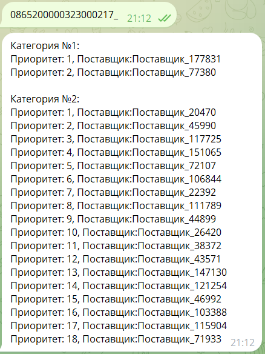
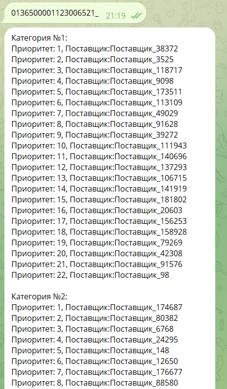

This project was developed during a hackathon organised by RLT.University, 
a project of Russia's largest federal operator of electronic trading for government customers, 
state companies and commercial enterprises (https://uni.roseltorg.ru/). 
The project is a telegram bot (https://t.me/RLT_hackaton_bot) that performs automated segmentation of suppliers 
for their effective involvement in electronic bidding. 
That is, the customer enters into the telegram bot the number of the item he wants to buy 
and the bot provides a ranked list of suppliers for that item.
https://uni.roseltorg.ru/article/otkryta-registraciya-na-intensiv-roseltorguniversiteta

The work explored all the business processes of supplying goods, domain specific data, the components that matter most for supplier selection, and created a supplier segmentation mechanism. 

Problem Solution Description:
Suppliers are divided into <b>2 segments</b> - first and second.

The first segment contains priority suppliers who have already supplied the given goods to the given region. I.e. these suppliers already have experience with this product and can be contacted. 

Then the second segment is formed, which includes suppliers who have no experience with the product, but we predict that they will be able to supply us with this product. This segment is formed using KNN model, i.e. a linear space with all suppliers is constructed, where each supplier has its own vector formed based on region and product embedding, which is taken from the short description of the product (also the embeddings are compressed into a 50-dimensional space using UMAP, which preserves non-linear dependencies to avoid the ‘Curse of Dimensionality’). It is safe to say that suppliers with similar region and goods will have a similar vector in vector space, so we simply take suppliers as close as possible in distance.

Examples of how the programme works (All vendors are encrypted):

